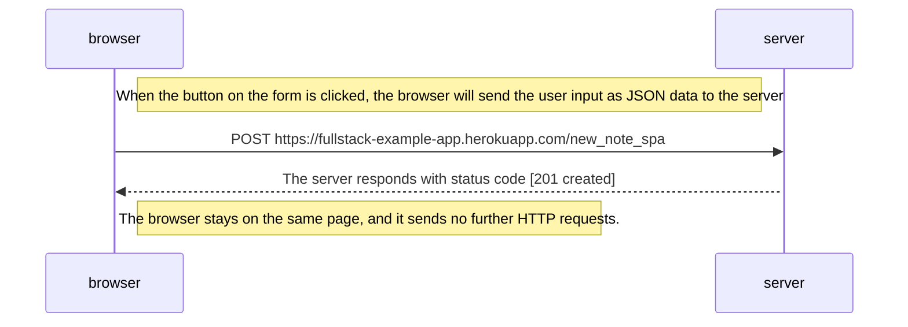

```mermaid
sequenceDiagram
    participant browser
    participant server

    Note right of browser: When the button on the form is clicked, the browser will send the user input as JSON data to the server

    browser->>server: POST https://fullstack-example-app.herokuapp.com/new_note_spa
    activate server
    server-->>browser: The server responds with status code [201 created]
        Note right of browser: The browser stays on the same page, and it sends no further HTTP requests.
```
